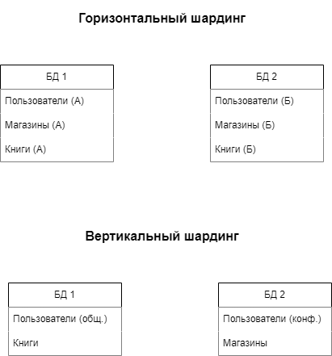

# `Домашнее задание к занятию «Репликация и масштабирование. Часть 2» - Зозуля Максим`

---

### Задание 1

Опишите основные преимущества использования масштабирования методами:

- активный master-сервер и пассивный репликационный slave-сервер; 
#### Дешевле, чем "master-сервер и несколько slave-серверов", но не обеспечивет бесперебойную работу системы, так как слейв не сразу берет на себя работу. В случае атаки, можно будет сделать откат системы.

-  master-сервер и несколько slave-серверов;
#### Обеспечивает высокую доступность к инфраструктуре и повышает скорость выборки данных.

- активный сервер со специальным механизмом репликации — distributed replicated block device (DRBD);
#### Обеспечивает высокую доступность к данным на диске.

- SAN-кластер.
#### Основным преимуществом сети SAN является то, что все согласования доступа к файлам осуществляются через Ethernet, в то время как файлы обслуживаются через чрезвычайно высокоскоростной Fibre Channel, что приводит к очень высокой производительности на клиентских рабочих станциях, даже для очень больших файлов.

*Дайте ответ в свободной форме.*

---

### Задание 2

Разработайте план для выполнения горизонтального и вертикального шаринга базы данных. База данных состоит из трёх таблиц: 

- пользователи, 
- книги, 
- магазины (столбцы произвольно). 

#### 1) Горизонтальный шардинг:

Разделение данные по горизонтали на основе определенного критерия, например, региона(А и Б), для более эффективного управления и доступа к данным.
Создадим несколько баз данных (нод) для хранения данных. Количество нод может зависеть от объема данных и требований к производительности.
Разделим таблицы между нодами в соответствии с критерием разделения. Например, пользователи и магазины из одного региона могут храниться в одной ноде, а пользователи и магазины из другого региона - в другой ноде.

#### 2)Вертикальный шардинг:

Разделим данные по вертикали на основе определенного критерия, например, типа атрибутов, для более эффективного управления и доступа к данным.
Создадим несколько баз данных (нод) для хранения данных. Каждая нода будет содержать определенные таблицы или столбцы данных.
Разделим атрибуты таблиц между нодами в соответствии с критерием разделения. Например, общие атрибуты пользователей(ФИО,регион,телефон) и информация о книгах могут храниться в одной ноде, а конфиденциальные атрибуты пользователей (пароли,финансовая инфа) и информация о магазинах - в другой ноде.

*Пришлите блоксхему, где и что будет располагаться. Опишите, в каких режимах будут работать сервера.* 

Режим чтения (read-only): Серверы в этом режиме предоставляют только операции чтения данных. Они могут быть использованы для обеспечения масштабируемости чтения и распределения нагрузки на чтение между серверами.

Режим записи (write-only): Серверы в этом режиме принимают только операции записи данных. Они могут быть использованы для обеспечения масштабируемости записи и распределения нагрузки на запись между серверами.

Режим чтения/записи (read-write): Серверы в этом режиме поддерживают как операции чтения, так и операции записи данных. Они могут быть использованы для обработки как чтения, так и записи данных, в зависимости от потребностей приложения.

---
